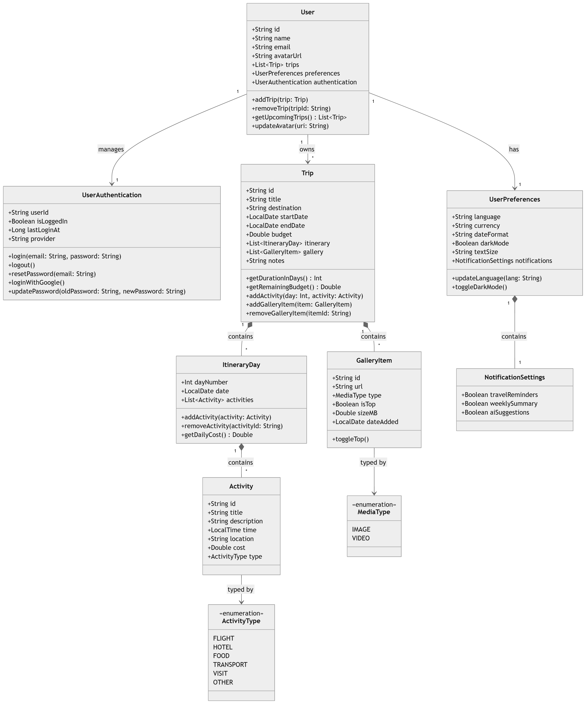

# Marvelous Dreamer — Design Document

## What is this app?

Marvelous Dreamer is an Android travel planner built with **Jetpack Compose** and **Material3**. It lets users organise trips, browse day-by-day itineraries, track budgets and explore a photo gallery for each journey.

---

## Architecture

The app follows **MVVM** (Model–View–ViewModel) with unidirectional data flow:

- **Model** — Kotlin `data class` objects in the `domain` package. All fields are immutable (`val`).
- **View** — Composable functions in `ui/screens/`. Each screen receives data as parameters and exposes events via lambda callbacks (`onBack`, `onTripClick`, etc.).
- **ViewModel** — Not yet implemented in Sprint 01. Mock data is passed directly to screens. ViewModels will be introduced in Sprint 02 alongside a proper repository layer.

The app uses a **single Activity** (`MainActivity`) with Jetpack Navigation Compose handling all transitions inside a `NavHost`.

---

## Package Structure

```
ui/
├── screens/        # One file per screen composable
├── navigation/     # NavGraph.kt, Routes.kt
├── themes/         # Color.kt, Theme.kt, Type.kt
└── MainActivity.kt

domain/             # Data models and mock data (Sprint 01)
```

---

## Navigation

Routes are defined as constants in `Routes.kt`. Dynamic routes use path parameters:

```
trip_detail/{tripId}
trip_gallery/{tripId}
```

`NavGraph` holds a `var activeTripId` that tracks the currently visible trip. This is updated via `onTripChanged` whenever the user switches trips with the arrow buttons, and is used by the bottom bar to navigate to the correct gallery or trip detail.

**Back navigation rules:**
- From trip detail → always goes to **Home**
- From trip gallery → goes back to the **specific trip**
- Everything else → `popBackStack()`

The bottom bar is hidden on `Splash` and `Terms`.

---

## Domain Model


