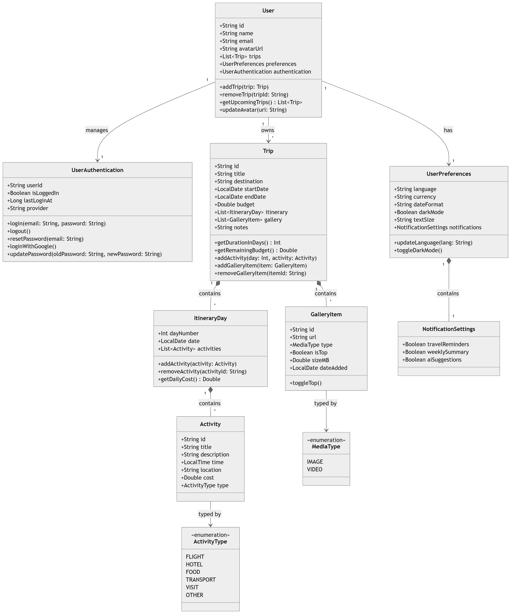

# Marvelous Dreamer — Design Document

## What is this app?

Marvelous Dreamer is an Android travel planner built with **Jetpack Compose** and **Material3**. It lets users organise trips, browse day-by-day itineraries, track budgets and explore a photo gallery for each journey.

---

## Architecture

The app follows **MVVM** (Model–View–ViewModel) with unidirectional data flow and dependency injection via **Hilt**:

- **Model** — Room entities in `data/local/entity/` and domain classes in `domain/`.
- **View** — Composable functions in `ui/screens/`. Each screen receives data as parameters and exposes events via lambda callbacks.
- **ViewModel** — `TripViewModel` and `AuthViewModel` in `ui/viewmodel/`, injected by Hilt. They expose state via `StateFlow` and delegate to repositories.
- **Repository** — `TripRepositoryImpl` and `AuthRepository` in `data/repository/`. They abstract the data source (Room DAOs, Firebase Auth).
- **Data Source** — Room Database (`AppDatabase`) with DAOs for trips, activities, users and access logs. Firebase Authentication for login/register.

Data flow: **UI → ViewModel → Repository → DAO/Firebase → SQLite/Cloud**

The app uses a **single Activity** (`MainActivity`, annotated with `@AndroidEntryPoint`) with Jetpack Navigation Compose handling all transitions inside a `NavHost`.

---

## Package Structure

```
com.example.marvelousdreamer/
├── MarvelousDreamerApp.kt         # @HiltAndroidApp
├── di/
│   └── AppModule.kt               # Hilt DI module (provides DB, DAOs, repos)
├── data/
│   ├── local/
│   │   ├── AppDatabase.kt         # Room Database class
│   │   ├── Converters.kt          # TypeConverters (LocalDate, LocalTime, ActivityType)
│   │   ├── dao/
│   │   │   ├── TripDao.kt
│   │   │   ├── ActivityDao.kt
│   │   │   ├── UserDao.kt
│   │   │   └── AccessLogDao.kt
│   │   └── entity/
│   │       ├── TripEntity.kt
│   │       ├── ActivityEntity.kt
│   │       ├── UserEntity.kt
│   │       └── AccessLogEntity.kt
│   ├── repository/
│   │   ├── TripRepositoryImpl.kt   # Room-based trip/activity CRUD
│   │   └── AuthRepository.kt       # Firebase Auth + local user persistence
│   └── preferences/
│       └── UserPreferencesManager.kt  # SharedPreferences (dark mode, language)
├── domain/
│   ├── Trip.kt
│   ├── Activity.kt
│   ├── ActivityType.kt
│   ├── TripRepository.kt          # Interface (suspend + Flow)
│   └── User.kt
└── ui/
    ├── MainActivity.kt            # @AndroidEntryPoint
    ├── screens/                   # Composable screens
    ├── navigation/                # NavGraph.kt, Routes.kt
    ├── viewmodel/
    │   ├── TripViewModel.kt       # @HiltViewModel
    │   └── AuthViewModel.kt       # @HiltViewModel
    └── themes/                    # Color.kt, Theme.kt, Type.kt
```

---

## Navigation

Routes are defined as constants in `Routes.kt`. Dynamic routes use path parameters:

```
trip_detail/{tripId}
trip_gallery/{tripId}
edit_trip/{tripId}
add_activity/{tripId}
edit_activity/{tripId}/{activityId}
```

**Auth flow (Sprint 03):** On app start, the splash screen checks if the user is logged in via Firebase. If not, the user is redirected to the Login screen. After login/register, the user goes to Home. Logout returns to Login.

**Back navigation rules:**
- From trip detail → always goes to **Home**
- From trip gallery → goes back to the **specific trip**
- From login/register → no back to Home (must authenticate)
- Everything else → `popBackStack()`

The bottom bar is hidden on Splash, Terms, auth screens and CRUD forms.

---

## Domain Model



---

## Database Schema (Sprint 03)

The app uses **Room** (SQLite) for local persistence. The database contains 4 tables:

### Tables

#### `trips`
| Column      | Type    | Constraints       | Description              |
|-------------|---------|-------------------|--------------------------|
| id          | TEXT    | PRIMARY KEY       | UUID                     |
| title       | TEXT    | NOT NULL          | Trip name                |
| description | TEXT    |                   | Trip description         |
| destination | TEXT    |                   | Destination city/country |
| startDate   | INTEGER | NOT NULL          | Epoch day (LocalDate)    |
| endDate     | INTEGER | NOT NULL          | Epoch day (LocalDate)    |
| budget      | REAL    |                   | Budget in EUR            |
| notes       | TEXT    |                   | Free text notes          |
| userId      | TEXT    |                   | Firebase UID (owner)     |

#### `activities`
| Column      | Type    | Constraints                          | Description           |
|-------------|---------|--------------------------------------|-----------------------|
| id          | TEXT    | PRIMARY KEY                          | UUID                  |
| tripId      | TEXT    | FOREIGN KEY → trips(id) ON DELETE CASCADE | Parent trip      |
| title       | TEXT    | NOT NULL                             | Activity name         |
| description | TEXT    |                                      | Activity description  |
| date        | INTEGER | NOT NULL                             | Epoch day (LocalDate) |
| time        | INTEGER | NOT NULL                             | Second of day (LocalTime) |
| location    | TEXT    |                                      | Place name            |
| cost        | REAL    |                                      | Cost in EUR           |
| type        | TEXT    |                                      | ActivityType enum     |

#### `users`
| Column       | Type    | Constraints | Description                |
|--------------|---------|-------------|----------------------------|
| id           | TEXT    | PRIMARY KEY | Firebase UID               |
| login        | TEXT    | NOT NULL    | Email address              |
| username     | TEXT    | NOT NULL    | Display name               |
| birthdate    | INTEGER |             | Epoch millis               |
| address      | TEXT    |             | Street address             |
| country      | TEXT    |             | Country name               |
| phone        | TEXT    |             | Phone number               |
| acceptEmails | INTEGER |             | Boolean (0/1)              |

#### `access_log`
| Column    | Type    | Constraints              | Description            |
|-----------|---------|--------------------------|------------------------|
| id        | INTEGER | PRIMARY KEY AUTOINCREMENT| Auto ID                |
| userId    | TEXT    | NOT NULL                 | Firebase UID           |
| action    | TEXT    | NOT NULL                 | "LOGIN" or "LOGOUT"   |
| timestamp | INTEGER | NOT NULL                 | System.currentTimeMillis() |

### Relationships

- **trips ← activities**: One-to-many. Each activity belongs to one trip via `tripId`. Cascade delete: removing a trip deletes all its activities.
- **users → trips**: One-to-many. Each trip is owned by one user via `userId`. Only the logged-in user's trips are shown.
- **users → access_log**: One-to-many. Every login/logout event is recorded with `userId` and timestamp.

### TypeConverters

Room cannot store `LocalDate`, `LocalTime` or `ActivityType` directly. The `Converters` class handles:
- `LocalDate` ↔ `Long` (epoch day)
- `LocalTime` ↔ `Int` (second of day)
- `ActivityType` ↔ `String` (enum name)

### Data Validation

- Trip title must be unique per user (checked via `isTitleDuplicate` query)
- Username must be unique (checked via `isUsernameTaken` query)
- Trip start date must be before end date (validated in ViewModel)
- Activity date must be within trip date range (validated in ViewModel)
- All date fields use DatePicker components (no free text input)